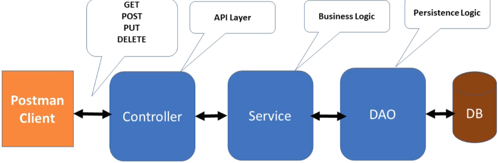

# Employee Management Project
Learn building REST APIs using Spring Boot, Spring Data JPA (Hibernate) and MariaDB database for Employee Management Project

Spring Boot is basically an extension of the Spring framework which eliminated the boilerplate configurations required for setting up a Spring application.

Spring Boot is an opinionated framework that helps developers build Spring-based applications quickly and easily. The main goal of Spring Boot is to quickly create Spring-based applications without requiring developers to write the same boilerplate configuration again and again.

Original course on Youtube: [Spring Boot Tutorial for Beginners](https://youtube.com/playlist?list=PLGRDMO4rOGcOKUURLsVMKZbCZhZJNtEwW)

## Tutorial Contents
Shortened 2h course on Udemy: [Spring Boot RESRful Web Services Tutorial](https://www.udemy.com/course/spring-boot-restful-web-services-tutorial-free-course)

01. Intro
02. Project Requirement and REST API Design
03. Quick Recap of JPA (Java Persistance API), Hibernate, and Spring Data JPA
04. Spring Boot Project Architecture
05. Create Spring Boot Project in STS
06. Create Packaging Structure
07. Configure MariaDB Database
08. Create Employee JPA Entity
09. Create Spring Data JPA EmployeeRepository
10. Create Custom Exception
11. Build *Create Employee REST API*
12. Build *Get All Employees REST API*
13. Build *Get Employee By ID REST API*
14. Build *Update Employee REST API*
15. Build *Delete Employee REST API*

And more.....
What you’ll learn

    Learn how to use Lombok library to reduce boilerplate code
    Learn how to build RESTful webservices using Spring Boot
    Learn how to develop three layer architecture (Controller, Service and Repository) in Spring boot application
    Learn how to connect Spring boot application to MariaDB SQL database
    Learn how to use Spring Data JPA in Spring boot application

You can check the original source code of this project in the author's GitHub [repository]((https://github.com/RameshMF/spring-boot-tutorial-course)).

## API Requirements
Create REST API for Employee Management System

REST client should be able to
- get a list of employees
- get a single employee by ID
- create a new employee
- update an existing employee
- delete an employee

## API Design
|HTTP Method|URL Path|Status Code|Description
|-|-|-|-|
|GET|`/api/employee`|200 (OK)|Get all employees
|GET|`/api/employee/{id}`|200 (OK)|Get single employee by Id
|POST|`/api/employee`|201 (Created)|Create a new employee
|PUT|`/api/employee/{id}`|200 (OK)|Update existing employee with Id
|DELETE|`/api/employee/{id}`|200 (OK)|Delete and employee by Id

## Tools and Technologies Used
- Spring Boot
- Spring Data JPA (Hibernate)
- [Lombok Library](https://projectlombok.org/)
- JDK 11
- Embedded Tomcat webserver
- [MariaDB Database](https://mariadb.org/documentation/)
- Maven dependency management
- Eclipse STS IDE
- Postman Client

## Spring Boot - Project Architecture


## Generate initial project
visit https://start.spring.io/ - Spring Boot Initializr

Enter the following settings:

* Project: Maven Project
* Language: Java
* Spring Boot: (highest stable. e.g. 2.6.5)
* Project Metadata
    * Group: `io.spring`
    * Artifact: `employees`
    * Name: `employees`
    * Description: `Employees API`
    * Package name: `io.spring.employees` 
    * Packaging: Jar
    * Java: 11

Click on *ADD DEPENDENCIES* on the right panel of the page. Add the following dependencies under each respective category:

* DEVELOPER TOOLS
    * Lombok - Java annotation library which helps to reduce boilerplate code.
* WEB
    * Spring Web - Build web, including RESTful, applications using Spring MVC. Uses Apache Tomcat as the default embedded container.
* SQL
    * Spring Data JPA - Persist data in SQL stores with Java Persistence API using Spring Data and Hibernate.
    * MariaDB Driver - MariaDB JDBC and R2DBC driver.

Click on **GENERATE** to download a zipped file named `employee.zip`. Unzip it into your project directory.

## Create additional project structure
in folder `src/main/java/io/spring/employees` create these folders
- `controller`
- `exception`
- `model`
- `repository`
- `service`
    - `impl`

## Install MariaDB
[MariaDB documentation](https://mariadb.org/documentation/)

on Ubuntu, open a terminal:
```Bash
$ sudo apt-get update
$ sudo apt-get install mariadb-server
```
Check installation, it should display the version, distribution, operating system, and architecture:
```Bash
$ mysqladmin --version
mysqladmin  Ver 9.1 Distrib 10.3.34-MariaDB, for debian-linux-gnu on x86_64
```
A fresh install (>= version 10) will have no password on user `root`. Enter into mysql prompt without password and set a password for `root`:
```Bash
$ sudo mysql
Welcome to the MariaDB monitor.
...

MariaDB [(none)]> SET PASSWORD FOR 'root'@'localhost' = PASSWORD('mypassword');
Query OK, 0 rows affected, 1 warning (0.000 sec)

MariaDB [(none)]> FLUSH PRIVILEGES;
Query OK, 0 rows affected (0.000 sec)

MariaDB [(none)]> exit
Bye
```

## Create database in MariaDB
Login as `root` with password:
```Bash
$ mariadb -u root -p
Enter password: 
Welcome to the MariaDB monitor.
...
```
create database `ems` (Employee Management System):
```Bash
MariaDB [(none)]> create database ems;
Query OK, 1 row affected (0.000 sec)

MariaDB [(none)]> exit
Bye
```

## Configure `application.properties` with MariaDB
in folder `src/main/resources` update file `application.properties`:
```Python
spring.datasource.url=jdbc:mariadb://localhost:3306/ems?useSSL=false
spring.datasource.username=root
spring.datasource.password=mypassword
spring.datasource.driver-class-name=org.mariadb.jdbc.Driver

# Hibernate properties
# from here: https://docs.jboss.org/hibernate/orm/5.3/javadocs/org/hibernate/dialect/package-summary.html
spring.jpa.properties.hibernate.dialect=org.hibernate.dialect.MariaDBDialect
# create, create-drop
spring.jpa.hibernate.ddl-auto=update
```

if the DB is production server, the first line should be (without the line breaks!)
```http
jdbc:mariadb://{mariaddb_server}/{database}
?useSSL=true
&sslMode=VERIFY_IDENTITY
&trustCertificateKeyStoreUrl=file:/etc/ssl/certs/java/cacerts
&trustCertificateKeyStorePassword=changeit
&enabledTLSProtocols=TLSv1.2
&useUnicode=true
&characterEncoding=utf8
```
See [this](https://beansandanicechianti.blogspot.com/2019/11/mysql-ssl-configuration.html) how to set up SSL for the production database server